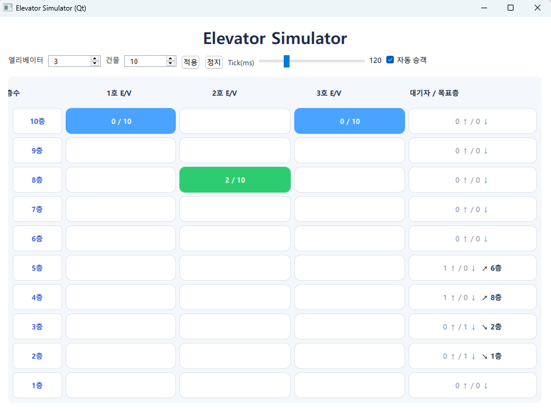

# Elevator Simulator (Qt/QML)

Qt Quick(QML)로 만든 **엘리베이터 시뮬레이터**입니다.  
실시간 틱 루프, 호출 배정(스케줄러), 탑승/하차, 층별 대기열 시각화를 제공합니다.  
UI는 **표 형태**(좌: 층수, 상단: 엘리베이터 헤더)로, 각 카의 **현재 층/문 상태/탑승 인원(예: 5 / 10)** 을 한눈에 확인할 수 있습니다.

---

## 📸 미리보기

- 상단: 시뮬레이터 제목 + 설정 툴바(엘리베이터 수, 층수, Tick 간격, 자동 승객 On/Off 등)
- 본문: 표 레이아웃(층 × 엘리베이터) + 오른쪽 대기열/대표 목표층 라벨

---

## ✨ 주요 기능

- **표 레이아웃 UI**: 층/엘리베이터/대기열을 테이블로 시각화
- **호출 배정**: Nearest-Bias 스케줄러(거리/방향불일치/적재율/유휴보너스 가중치)
- **랜덤 승객 생성(옵션)**: 층·목적층 기반 상·하행 호출 자동 발생
- **탑승/하차/정원**: 문 열림 시 하차 → 빈 좌석만큼 탑승, 만석 시 색상 경고
- **실시간 틱 루프**: 이동/문열림/문닫힘을 단계적으로 시뮬레이션
- **층별 대기열 표시**: `N ↑ / M ↓` + 대표 **목표층 라벨(↗ 15층 / ↘ 3층)**

---

### 요구 사항
- Qt 6.7 (Qt Quick, Qt Quick Controls, Qt Quick Layouts)
- C++17

## 🏗️ 파일별 역할 (플랫 구조)

### C++ (로직/모델)

#### `SimClock.h`
공용 타입/유틸 및 (옵션) 시계 래퍼.
- `enum class Dir { Down, Idle, Up }`
- `struct HallCall { floor, dir, dest, t_req }` — 층/방향/목적층/요청시각
- `struct CarReq { floor, t_req }`
- `struct CarState { id, floor, dir, doorOpen, load, capacity, upTargets, downTargets }`
- `class SimClock` — 현재는 `QTimer` 래핑 자리(확장 대비)

#### `ElevatorCar.h` / `ElevatorCar.cpp` — 엘리베이터 1대의 상태/동작
- **Q_PROPERTY**: `id`, `floor`, `doorOpen`, `load`, `capacity`, `full`
- **내부 목적지 큐**: `m_upTargets`, `m_downTargets`
- **문 사이클**: `Open → Dwell → Close → Move`
- **API**
  - `pushHallPickup(const HallCall&)` — 픽업층 등록(데모 편의상 목적층 선등록 가능)
  - `pushInside(int floor)` — 내부 버튼 목적층 등록
  - `tick()` — 1틱 진행(이동/정지/문 상태 전환)
  - `boardTo(int dest, int count=1)` — 탑승(목적층 등록 + 인원 증가)
  - `dropHere()` — 현재 층 하차 처리(인원 감소)
- **캐시/신호**: `rebuildCache()`로 `CarState` 갱신 → QML 바인딩

#### `Scheduler.h` / `Scheduler.cpp` — 호출 배정기
- `class Scheduler { onHallCall, assign }` (순수가상 인터페이스)
- `class NearestBiasScheduler`
  - 점수 = `A*distance + B*dirMismatch + C*loadRatio - D*idleBonus`
  - 최저 점수의 카에 호출 할당 → `car->pushHallPickup(hc)`

#### `PassengerGen.h` / `PassengerGen.cpp` — 랜덤 승객 생성기
- `maybeSpawn()` → `HallCall`(층/목적층/방향/시간) 반환
- `setFloors(int)`, `setSpawnProb(double)`

#### `Metrics.h` / `Metrics.cpp` — 간단 지표 집계
- 대기시간 평균/최대: `addWait(qint64)`, `avgWait()`, `maxWait()`

#### `Building.h` / `Building.cpp` — 시뮬레이터 상위 오브젝트(QML 공개)
- **Q_PROPERTY**: `floors`, `cars(QVariantList)`, `running`, `tickMs`
- **Q_INVOKABLE**:
  - `setup(int floors, int cars)`, `configure(int floors, int cars)`
  - `start()`, `stop()`
  - `callUp(int)`, `callDown(int)`, `pushInside(int carId, int floor)`
- **대기열/라벨**: `waitUp`, `waitDown` (층별 인원), `waitDestLabel` (대표 목표층 라벨)
- **틱 루프(`tick`)**
  1. 랜덤 승객 생성 → 스케줄러 등록 + 대기열 카운트 증가  
  2. 스케줄러가 pending 호출을 카에 할당  
  3. 각 카 `tick()` 진행  
  4. **문 열림 엣지**에서: `dropHere()` → 빈 좌석만큼 `boardTo(dest)` 탑승
- 수동 호출(`callUp/Down`)도 대기열 카운트에 반영

#### `main.cpp`
- `Building` 타입 QML 등록 + `Main.qml` 로드.

---

### QML (UI)

#### `Main.qml`
- 상단 타이틀 + 설정 툴바(엘리베이터 수, 층수, Tick 속도, 자동 승객 On/Off)
- 본문 `ScrollView` 내부에 `BuildingView` 배치

#### `BuildingView.qml` — 표 레이아웃 시각화
- 헤더: `층수 / N호 E/V / … / 대기자/목표층`
- 각 층 행:
  - 좌측: 층수
  - 중앙: 엘리베이터 셀(해당 층일 때 색상 + `load / capacity`)
  - 우측: 대기열(`N↑/M↓`) + 목표층 라벨(`↗ 15층` 또는 `↘ 3층`)
- 밝은 톤 스킨, 고정 행 높이, 스크롤 대응

#### `ControlsPane.qml` *(필요 시 `Main.qml`로 흡수 가능)*
- Start/Stop, Reset, Tick 슬라이더, 수동 호출(층 입력 → Up/Down) UI

---

## 🔄 동작 개요
1. 틱 루프(`QTimer`)가 `Building::tick()`을 주기적으로 호출  
2. `PassengerGen`이 확률적으로 `HallCall`을 생성 → 스케줄러에 전달  
3. 스케줄러가 호출을 적합한 카에 배정 → 카 내부 큐에 픽업/목적층 등록  
4. `ElevatorCar::tick()`이 목표층으로 이동  
5. 도착 후 문 열림 → `dropHere()`로 하차 → 빈 좌석만큼 `boardTo(dest)`로 탑승  
6. QML은 `CarState`/대기열 바인딩으로 실시간 표 갱신

---

## ⚙️ 주요 파라미터
- `tickMs` — 틱 간격(ms)
- `PassengerGen::prob` — 틱당 승객 생성 확률(기본 0.08)
- `ElevatorCar` 문 사이클 — `open/dwell/close` 틱 수
- `NearestBiasScheduler` 가중치 — `A_distance`, `B_dirMismatch`, `C_load`, `D_idleBonus`
- `capacity` — 1대 정원(기본 10)

---

## 🧭 로드맵(향후 개선)
- 수요 모드: Up-Peak / Down-Peak / Lunch + `seed`로 재현성
- 현실화: 탑승/하차 속도 제한, **이탈(reneging)**, 장애/정비 모드
- 지표 대시보드: P50/P90/P95 대기, 층별 승·하차 바차트, 병목 라인차트
- 스케줄러 플러그인: Zoning, Parking, ETA 기반, Destination Dispatch
- 코스트 모델: 이동/정지 에너지, 재생효과, 다목표 최적화
- Auto-Tuner: 스코어 가중치 자동 탐색(랜덤 탐색 → 힐클라임/베이지안 최적화)
- 테스트: QTest로 경계/회귀, 동일 `seed` 재현 확인
